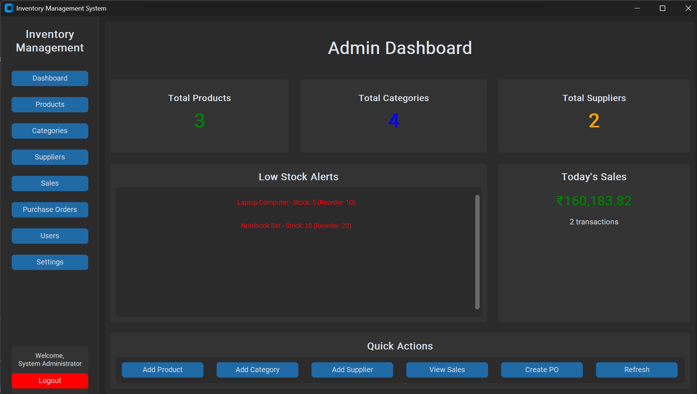

# Inventory Management System

A desktop inventory, billing and purchasing application for small retail businesses, built with Python and CustomTkinter on a MySQL backend.

## Overview

The application covers the day-to-day running of a small shop: products, categories and suppliers, stock levels, sales billing with printable PDF invoices, purchase orders and user accounts. Access is role-based — Admin, Employee and Supplier each see a different dashboard and a different set of screens.

It runs as a local desktop application and talks to a MySQL server directly through PyMySQL.

## Features

- Role-based dashboards for Admin, Employee and Supplier
- Product, category and supplier management
- Sales billing with PDF invoice generation
- Purchase orders and sales tracking
- Dashboard statistics and charts
- User management with a password strength policy
- Email OTP password reset and emailing of documents (requires SMTP settings)
- Theme and UI scaling preferences

## Screenshots

**Admin dashboard**



## Tech Stack

| Layer | Technologies |
| --- | --- |
| Language / GUI | Python 3.10+, Tkinter with CustomTkinter |
| Database | MySQL via PyMySQL |
| Reporting | ReportLab (PDF invoices), Matplotlib (charts) |
| Other | Pillow, cryptography |

## Project Structure

```
inventory-management-system/
├── main.py                 # Application entry point
├── db.py                   # Connection handling and database/table initialisation
├── config.py               # Database, email and application settings
├── auth.py                 # Login, password policy, OTP and email helpers
├── login_frame.py
├── admin_dashboard.py
├── employee_dashboard.py
├── supplier_dashboard.py
├── products_frame.py
├── categories_frame.py
├── suppliers_frame.py
├── users_frame.py
├── billing_frame.py
├── sales_frame.py
├── purchase_orders_frame.py
├── settings_frame.py
├── invoice_pdf.py          # PDF invoice generation
├── setup.py                # Optional cx_Freeze packaging
├── requirements.txt
└── .env.example
```

## Installation

Requires **Python 3.10 or newer** (as stated in the in-app Settings screen) and a running MySQL server.

```bash
python -m venv venv
venv\Scripts\activate          # Windows
pip install -r requirements.txt
```

## Configuration

Settings are defined in `config.py`:

| Setting | Default | Notes |
| --- | --- | --- |
| `DB_CONFIG['host']` | `localhost` | MySQL host |
| `DB_CONFIG['user']` | `root` | MySQL user |
| `DB_CONFIG['password']` | `os.getenv('DB_PASSWORD', '1234')` | Reads the `DB_PASSWORD` environment variable, with a local development fallback |
| `DATABASE_NAME` | `inventory_db3` | Created automatically if it does not exist |
| `EMAIL_CONFIG['smtp_user']` / `smtp_password` | empty | Required for OTP reset and emailing documents |
| `APP_SETTINGS['tax_rate']` | `0.18` | 18% GST applied to billing |

A root-level `.env.example` lists `DB_HOST`, `DB_USER`, `DB_PASSWORD` and `DB_NAME` as a reference. Only `DB_PASSWORD` is read from the environment at runtime; the remaining values are set in `config.py`.

## Database Setup

Create the database and tables once before the first run:

```bash
python db.py
```

This creates the `inventory_db3` database and its tables if they do not already exist.

## Running the Application

```bash
python main.py
```

## Demo Credentials

No real credentials are shipped. Create your own admin account through the in-app user management screen, or use a fictional demo account such as `admin` / `demo1234`.

## Notes / Limitations

- Requires a local MySQL server; there is no bundled database.
- Desktop-only interface — there is no web or mobile client.
- The SMTP settings in `config.py` must be filled in before OTP password reset or email features will work.
- Development was AI-assisted: requirements, database schema, UI direction, debugging, testing and integration were done by the author; AI tooling assisted with scaffolding and boilerplate.
- Development dates are approximate. The project was published to GitHub as a single initial commit rather than being developed in public.

## Future Improvements

- Web dashboard and REST API.
- Barcode scanning and automated stock alerts.
